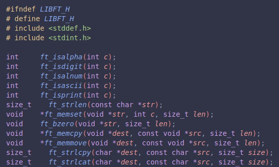

# Libft

Libft is a solo C project from École 42 where the goal is to rebuild a personal utility library from scratch.

At 42, students are not allowed to rely on most of the C Standard Library in early projects. That means common functions like `strlen`, `memcpy`, `atoi`, `calloc`, and `strdup` have to be understood, reimplemented, tested, and then reused as the foundation for later work.

This repository builds those functions into a static library, `libft.a`.



## Project Context

- School: École 42
- Type: Solo project
- Time spent: 1 month, November 2022 to December 2022
- Final grade: 125/100
- Bonus: All bonus requirements completed

## What This Library Contains

The project is organized into several groups of C functions:

- `srcs/mandatory`: required reimplementations of common libc-style functions for character checks, memory operations, string handling, number conversion, allocation, and file descriptor output.
- `srcs/bonus`: linked-list utilities using the `t_list` structure required by the bonus section.
- `srcs/gnl`: `get_next_line`, a function that reads one line at a time from a file descriptor.
- `srcs/ft_printf`: a custom `printf` implementation with bonus flag handling.
- `srcs/custom`: additional helper functions added for later personal use in other C projects.

Together, the repository contains 69 C source files and exposes its main API through the headers in `includes/`.

## Why This Project Is Challenging

Libft looks simple at first because many functions already exist in standard C. The hard part is recreating them correctly without using the originals.

Students have to handle edge cases manually: null pointers, empty strings, overlapping memory regions, allocation failures, integer limits, and exact return values. Small differences from the standard behavior can break later projects that depend on this library.

Memory management is also central. Functions such as `ft_split`, `ft_strjoin`, `ft_strdup`, and the linked-list utilities allocate memory that must be cleaned up correctly. A working solution is not enough; it also needs to avoid leaks, invalid reads, and double frees.

The bonus work adds another layer by introducing linked lists. These functions require careful pointer manipulation, ownership rules, and cleanup callbacks.

This version also includes two larger 42-style extensions:

- `get_next_line`, which keeps track of unread buffered data between calls while reading from file descriptors.
- `ft_printf`, which parses format strings, variadic arguments, width, precision, and formatting flags.

Those two projects are commonly difficult because they combine parsing, dynamic memory, state management, and strict output compatibility.

## Building

Run:

```sh
make
```

This creates:

```text
libft.a
```

The Makefile also generates `compile_commands.json` for editor tooling.

Useful commands:

```sh
make clean
make fclean
make re
```

## How It Is Used

Other C projects can include the headers and link against `libft.a`:

```c
#include "libft.h"
#include "gnl.h"
#include "ft_printf.h"
```

This library became the reusable base layer for later projects where standard library access remained limited.

